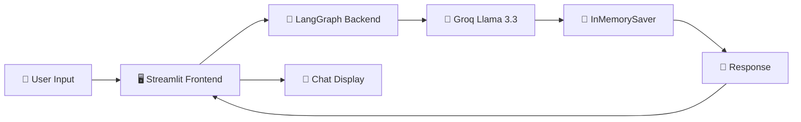

# 🤖 LangGraph Chatbot

<div align="center">


**A production-ready chatbot built with LangGraph's state management and Streamlit's interactive UI**

[🚀 Quick Start](#-quick-start) • [🏗️ Architecture](#%EF%B8%8F-architecture) • [💡 Features](#-features) • [🔧 Setup](#-setup)

</div>

---

## 🌟 Overview

This chatbot demonstrates the power of **LangGraph** for building stateful conversational AI applications. Built with modern tools like **Streamlit** for the frontend and **Groq's Llama 3.3** for lightning-fast inference, it showcases how to create production-ready chatbots with persistent conversation memory.

## ✨ Features

🔄 **Persistent Conversations** - Maintains chat history across interactions using LangGraph's checkpointing  
⚡ **Lightning Fast** - Powered by Groq's optimized Llama 3.3-70B model  
🎨 **Beautiful UI** - Clean, intuitive Streamlit interface  
🧠 **State Management** - Advanced state handling with LangGraph's StateGraph  
💾 **Memory Persistence** - In-memory conversation storage with InMemorySaver  
🔧 **Modular Design** - Separated backend logic and frontend presentation  

## 🏗️ Architecture



### 🔧 Core Components

| Component | Purpose | Technology |
|-----------|---------|------------|
| **Frontend** | User interface & chat display | Streamlit |
| **Backend** | State management & conversation flow | LangGraph |
| **LLM** | Natural language processing | Groq Llama 3.3-70B |
| **Memory** | Conversation persistence | InMemorySaver |
| **State** | Message history tracking | StateGraph |

## 🚀 Quick Start

### Prerequisites
- Python 3.8+
- Groq API Key
- Virtual environment (recommended)

### 1️⃣ Clone & Navigate
```bash
cd CHATBOT
```

### 2️⃣ Environment Setup
```bash
# Activate your virtual environment
# On Windows:
.\langgraph-env\Scripts\Activate.ps1

# Install dependencies (if not already installed)
pip install streamlit langgraph langchain-groq python-dotenv
```

### 3️⃣ Configure Environment
Create a `.env` file in the parent directory with your Groq API key:
```env
GROQ_API_KEY=your_groq_api_key_here
```

### 4️⃣ Launch the Chatbot
```bash
streamlit run streamlit_frontend.py
```

🎉 **That's it!** Your chatbot will open in your browser at `http://localhost:8501`

## 💡 How It Works

### 🔄 Conversation Flow

1. **User Input** → User types a message in Streamlit interface
2. **State Update** → Message added to conversation history
3. **LangGraph Processing** → Backend processes message through StateGraph
4. **LLM Inference** → Groq's Llama 3.3 generates response
5. **Memory Storage** → Conversation saved with InMemorySaver
6. **UI Update** → Response displayed in chat interface

### 🧠 State Management

```python
class ChatState(TypedDict):
    messages: Annotated[list[BaseMessage], add_messages]
```

The chatbot uses LangGraph's powerful state management to:
- ✅ Track conversation history
- ✅ Maintain context across messages
- ✅ Enable future enhancements (tools, memory, etc.)

## 🔧 Customization

### 🎨 Change the Model
Modify `langgraph_backend.py`:
```python
model = ChatGroq(model="mixtral-8x7b-32768")  # Different model
```

### 🎭 Add System Prompt
```python
def chat_node(state: ChatState) -> ChatState:
    system_message = SystemMessage(content="You are a helpful assistant...")
    messages = [system_message] + state['messages']
    response = model.invoke(messages)
    return {'messages': [response]}
```

### 🎨 Customize UI
Edit `streamlit_frontend.py` to:
- Change page title: `st.set_page_config(page_title="My Chatbot")`
- Add sidebar: `st.sidebar.title("Chat Settings")`
- Modify styling with CSS

## 📁 Project Structure

```
CHATBOT/
├── 📄 README.md              # This file
├── 🤖 langgraph_backend.py   # LangGraph state management
├── 🖥️ streamlit_frontend.py  # Streamlit UI
└── 📓 Chatbot_Workflow.ipynb # Development notebook
```

## 🛠️ Advanced Features

### 🔮 Future Enhancements
- 🔧 **Tool Integration** - Add web search, calculations, etc.
- 🗃️ **Database Storage** - Replace InMemorySaver with persistent DB
- 👥 **Multi-user Support** - Individual conversation threads
- 🎨 **Custom Themes** - Personalized UI styling
- 📊 **Analytics Dashboard** - Conversation insights

### 🧪 Development Mode
Use the included Jupyter notebook for experimentation:
```bash
jupyter notebook Chatbot_Workflow.ipynb
```

## 🤝 Contributing

Found a bug or want to add a feature? Contributions are welcome!

1. Fork the repository
2. Create a feature branch
3. Make your changes
4. Submit a pull request

## 📝 License

This project is part of the LangGraph Tutorials collection.

---

<div align="center">

**Built with ❤️ using LangGraph and Streamlit**

⭐ **Star this repo if you found it helpful!** ⭐

</div>
